
# Dokumentation Uebung1
## Frank Hasenbalg, 571087

### MotionBuilder
Ich habe im Asset Browser Cube, Plane und Sphere in die Scene gezogen. Die Framerate habe ich auf 30 fps gestellt und die Animationslaenge auf 450 Bilder gestellt.

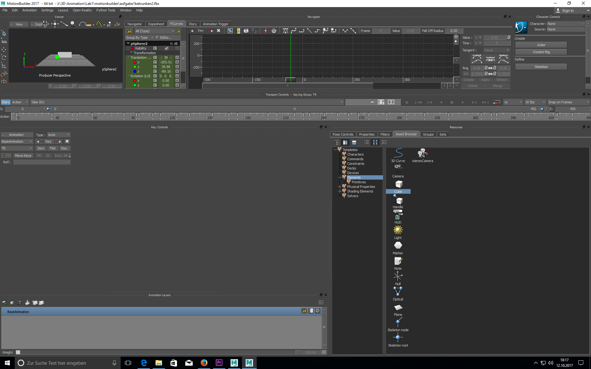
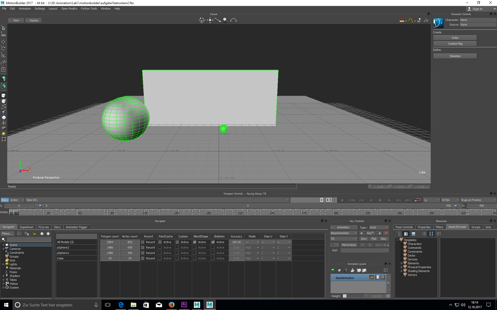
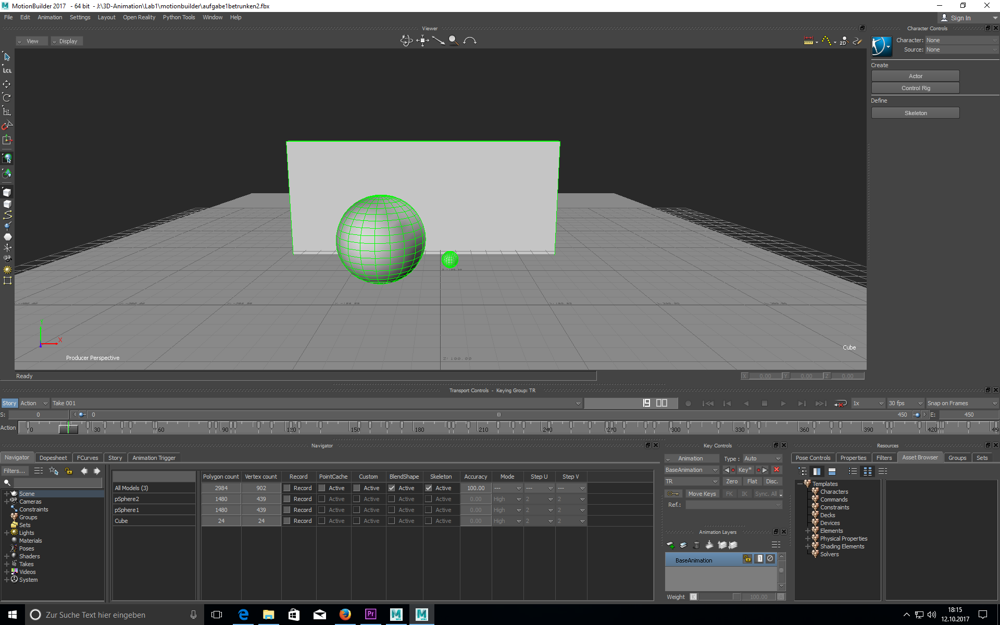

Ich habe fuer jeden Keyframe zuerst die Position auf der Zeitleiste gewaehlt, dann das Objekt ausgewaehlt, das Objekt auf die richtige Position gebracht, die Skalierung angepasst und den Keyframe gesetzt.

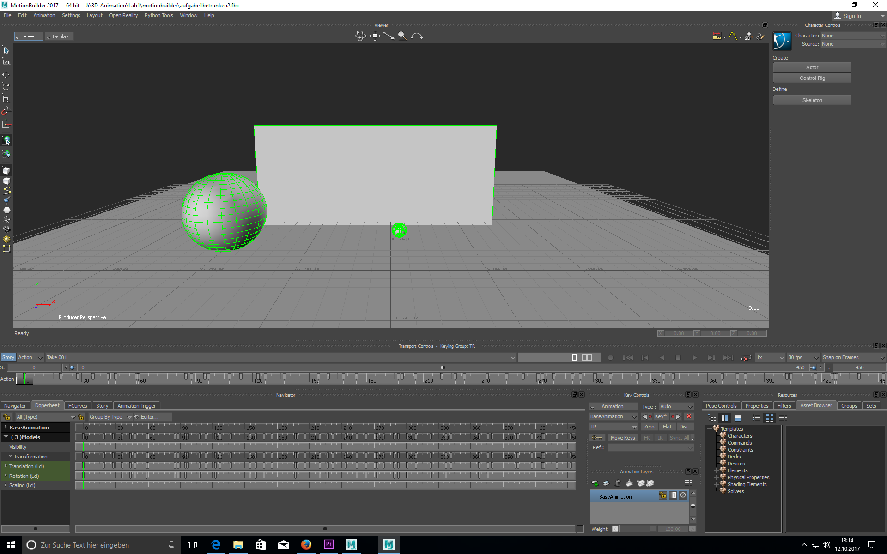
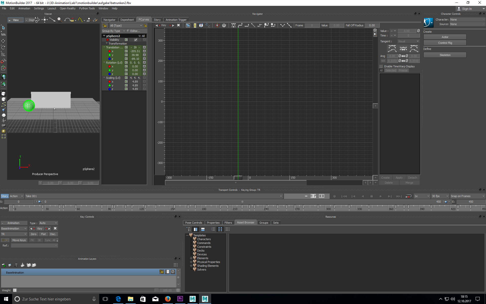

Dann habe ich die Funktionskurven im FCurves Editor bearbeitet und die Position der Keyframes im Dopesheet Editor korrigiert.

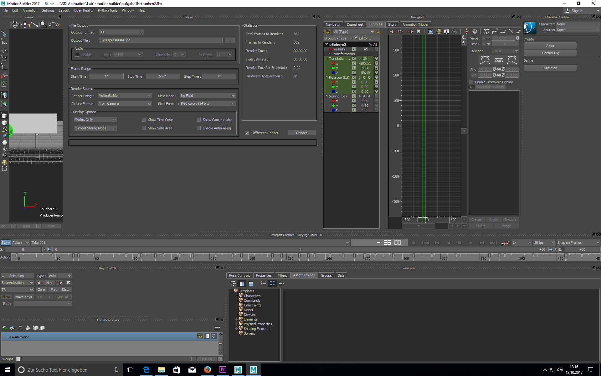

Danach habe ich die Formalien fuer den Film angegeben und ihn in Einzelbilder gerendert. Die Bilder wurden mit Premiere zu einem Film gerendert.

### Maya
Ich habe Cube, Plane und Sphere aus der oberen Leiste in die Scene gezogen. Die Framerate habe ich auf 30 fps und die Animationslaenge auf 450 Bilder gestellt.

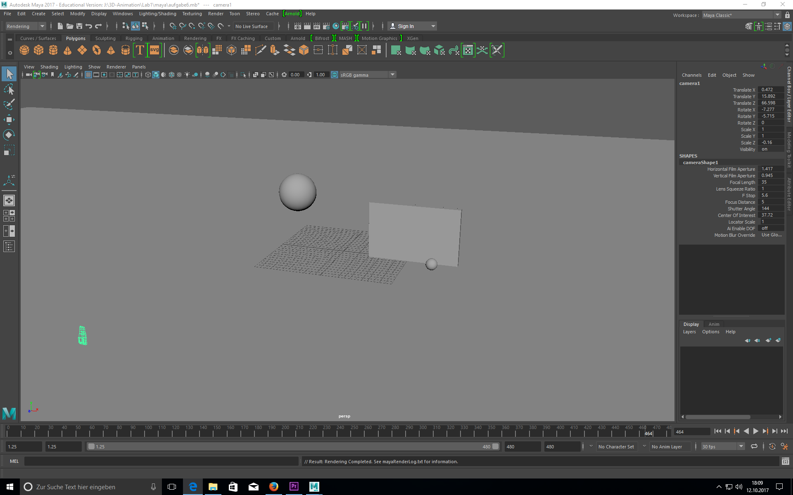

Ich habe fuer jeden Keyframe zuerst die Position auf der Zeitleiste ausgewaehlt, dann das zu animierende Objekt ausgewaehlt. Das Objekt wurde dann auf Position gebracht, die Skalierung angepasst und den Keyframe gesetzt.
Der Quadview war dabei hilfreich.

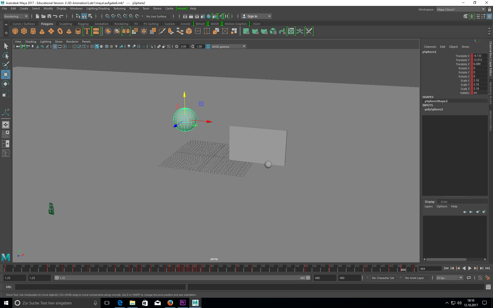
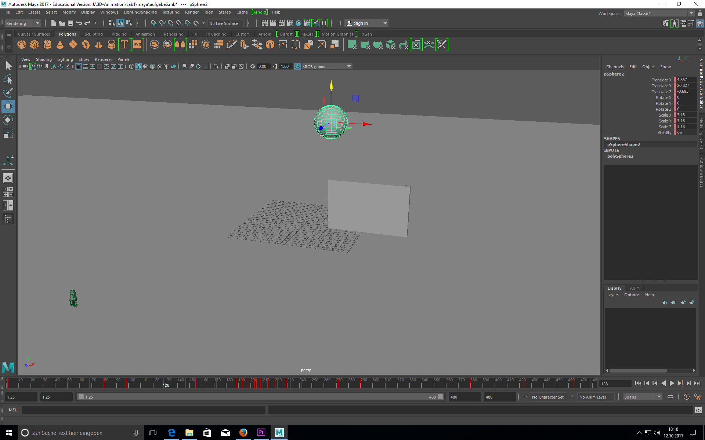

Dann habe ich die Animationsskurven im Graphen Editor  bearbeitet und die Position der Keyframes imDope Sheet korrigiert.

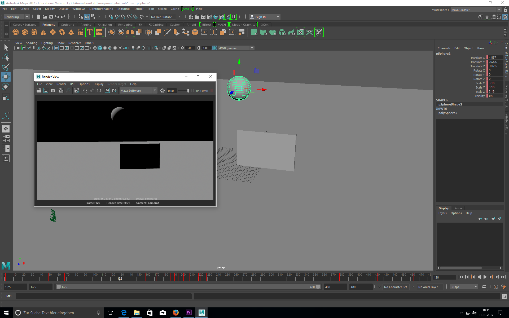

Um die Animation zu rendern habe ich in den Einstellungen die Werte entsprechend gesetzt ueber die Funktion "Batch Render" die Animation als PNG gerendert.

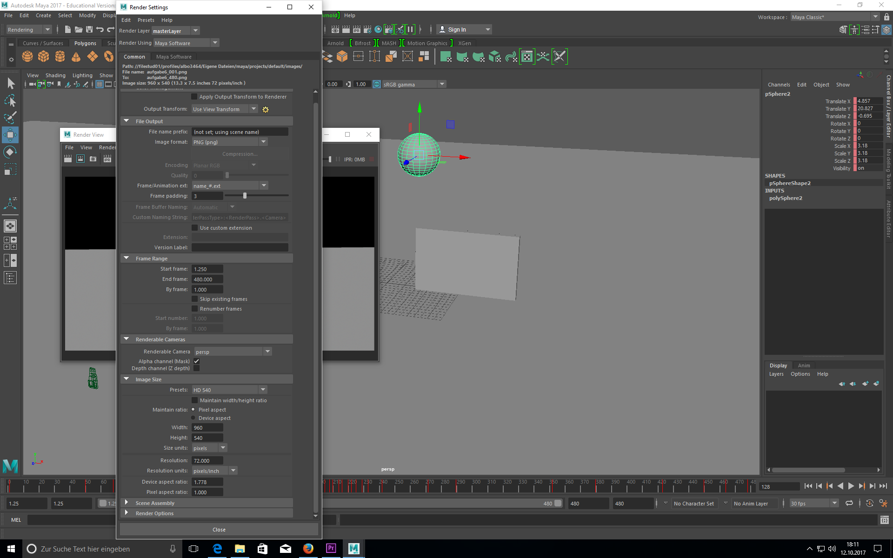

Die Bilder wurden mit Premiere zu einem Film gerendert.

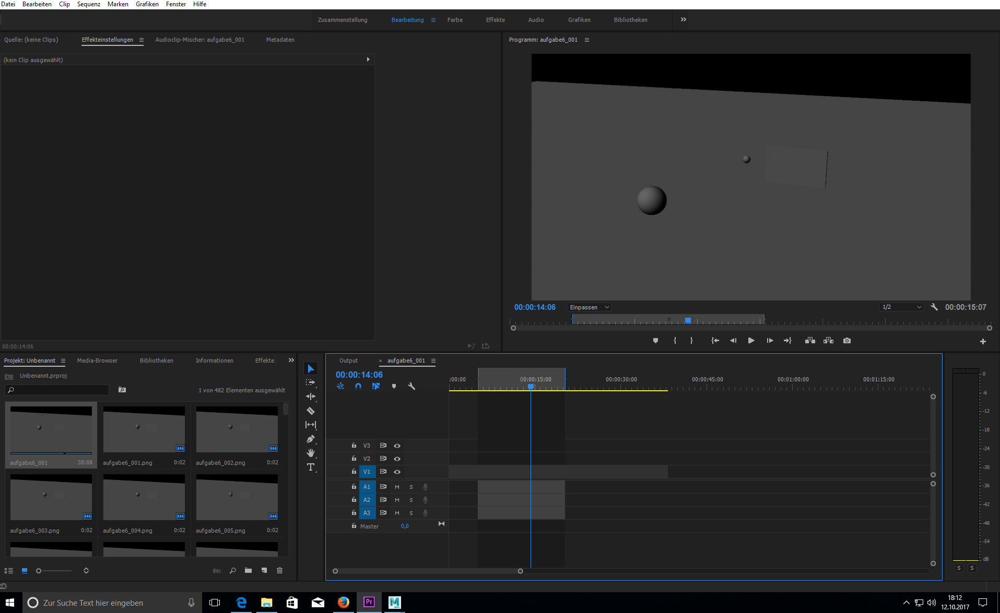

### Blender

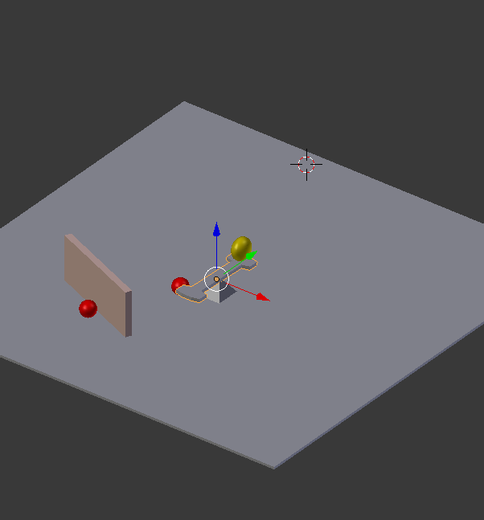

Ich habe Cube, Plane und Sphere in die Scene gezogen und schnell eine Wippe modelliert. Die Framerate habe ich auf 30 fps gestellt und die Animationslaenge auf 450 Bilder gestellt.

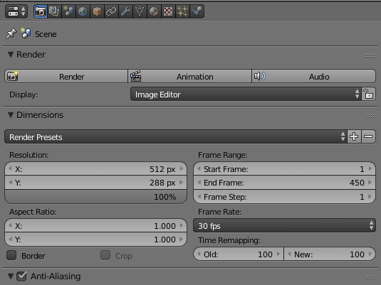

Zeitleiste:

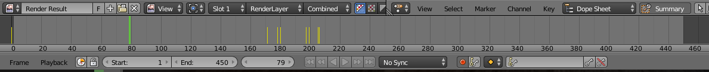

Ich habe fuer jeden Keyframe zuerst die Position auf der Zeitleiste ausgewaehlt, dann das zu animierende Objekt ausgewaehlt. Das Objekt wurde dann auf Position gebracht, die Skalierung angepasst und den Keyframe gesetzt.
Der Quadview war dabei hilfreich.

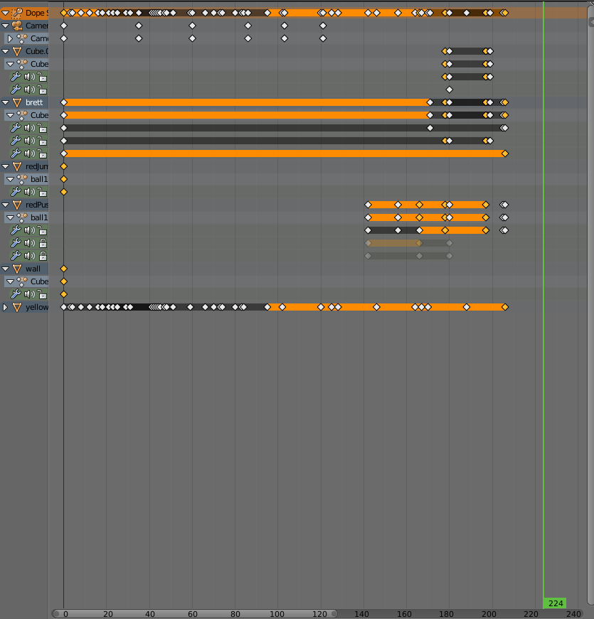
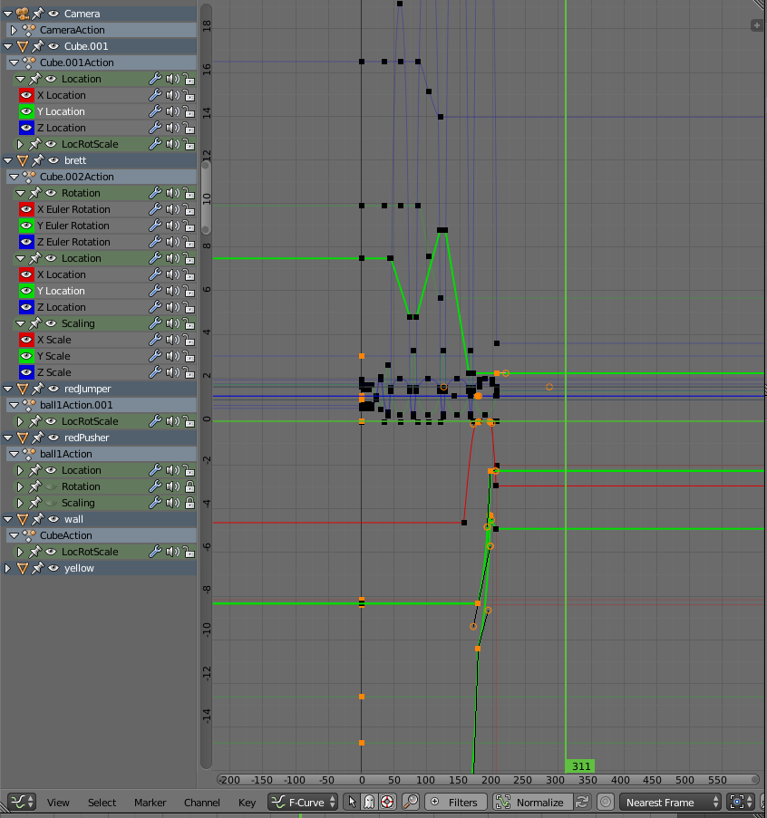

Um die Animation zu rendern, habe ich die entsprechenden Werte im Render-Settings-Tab eingetragen und auf "Animation" gedrueckt.
blender hat die ANimation als Film gerendert.

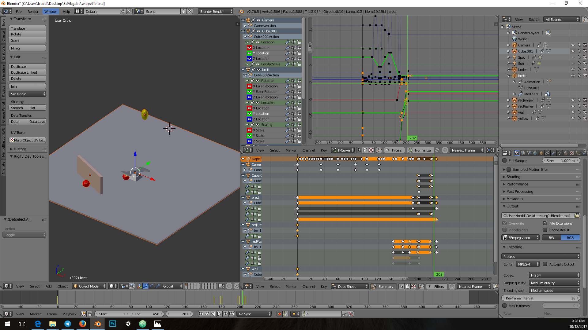
