# Dokumentation Aufgabe 2
## Frank Hasenbalg, 571087
### Kopf-Modell
Das Modell des Kopfes ist von Makehuman. Ich habe ein menschliches Mesh generiert und als OBJ zusammen mit der Textur exportiert. Die beiden Teile habe ich in eine Blender-Szene geladen und alles entfernt, was nicht von Nutzen war.

### Shapekeys
Fuer die Shapekeys habe ich die Mundregion und den Unterkiefer des Kopfes verformt.
Aehnlichen lauten wurden die gleichen Formen zugewiesen.

Meist habe ich *Proportional Editing* genutzt.

### Ball texturieren

Ich habe eine Kappe der Sphere in Quads verwandelt, den unteren Teil der Sphere geloescht unf mit dem Mirror-Modifier neu generiert.

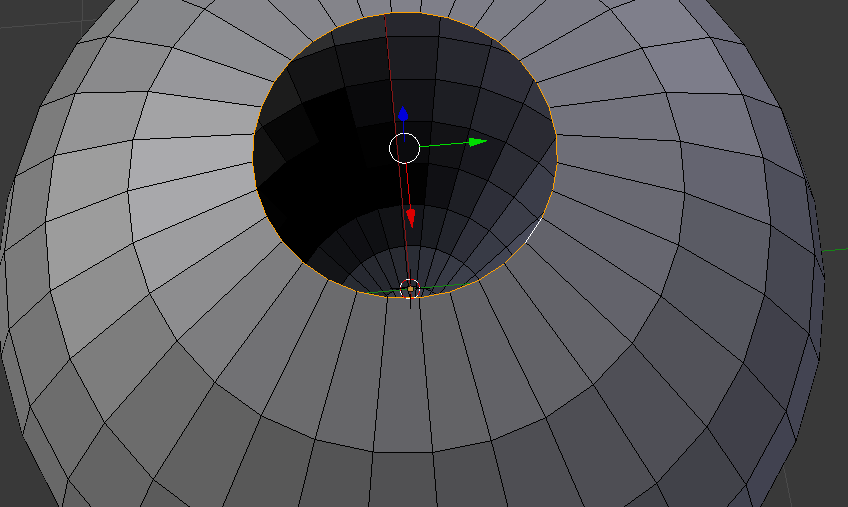

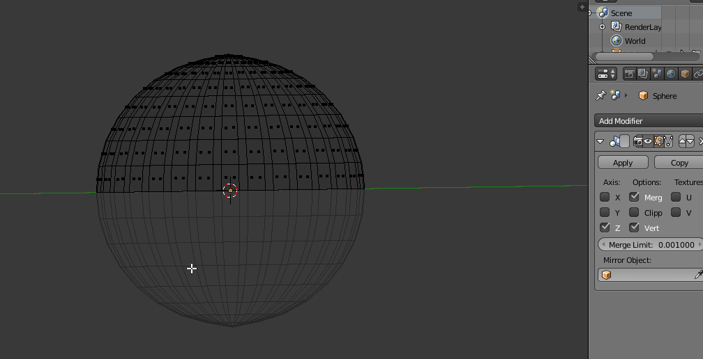

Dann habe ich den Modifier angewendet und an einer Seite eine Naht gesetzt.

Abgewickelt wurde die Sphere mit der Option *Apply to Oppject* in *Sphere Projection*.

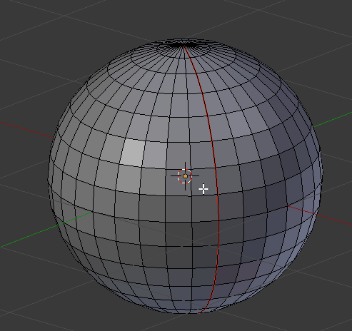

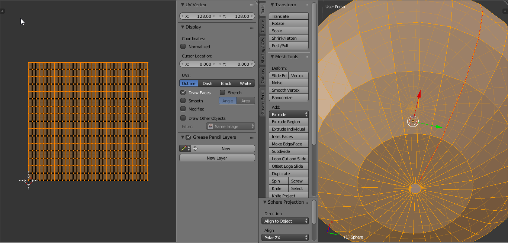

Dann habe ich eine neue Textur erstellt, auf die die Matereialien gebacken werden sollen .

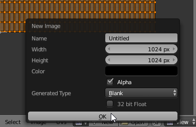

Es wurden 2 Materialien angelegt. Ein rotes und ein weisses.

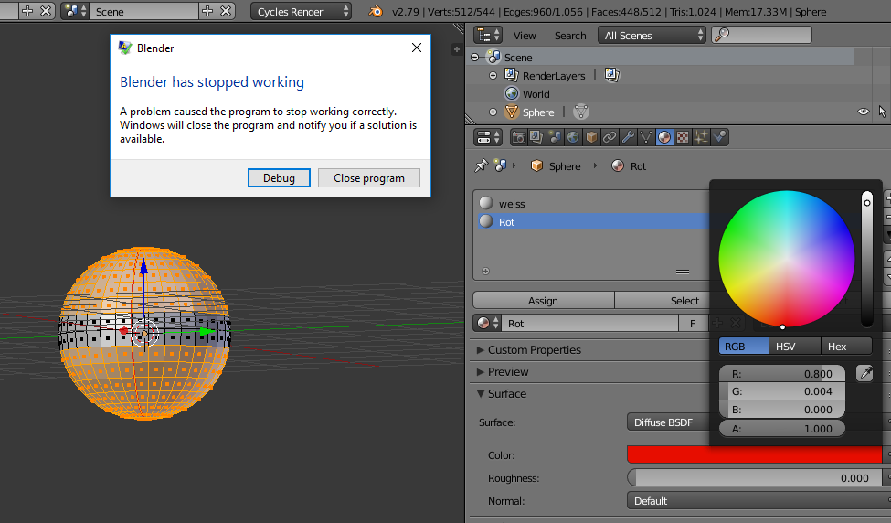

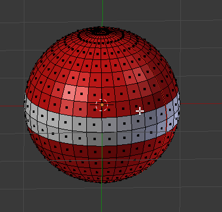

In beide Materialien babe ich im Cycles Node Editor einen Image Texture Node gelegt, dessen Bildpfad auf die Textur zeigt.

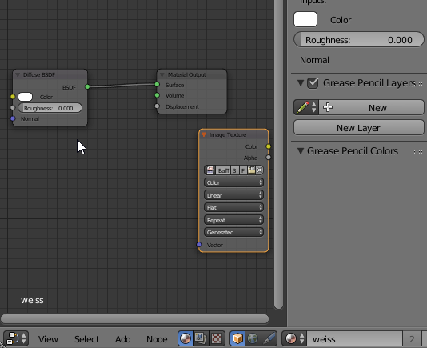

Zum backen nehm ich Mehl, Eier, Milch, Hefe und Ambient Occlusion und stelle dann im *Bake*-Menu aud Diffuse und *Color*.

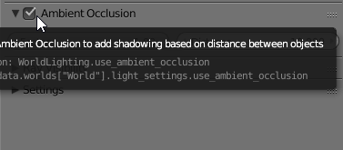

Jetzt wird gebacken.

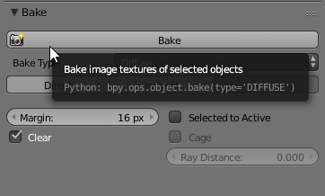

Meine gebackene Textur erinnert mich stark an die Oesterreichische Flagge.

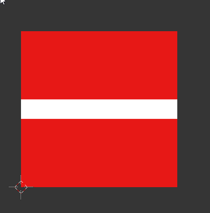

Mit *F3* wird das Bild gespeichert und dann ueber das *External Data*-Menu un die Blender-Datei gepackt.

Fuer die neue Textur habe ich ein neues material angelegt, und als *Image Texture* die frischgebackene Flagge genommen.

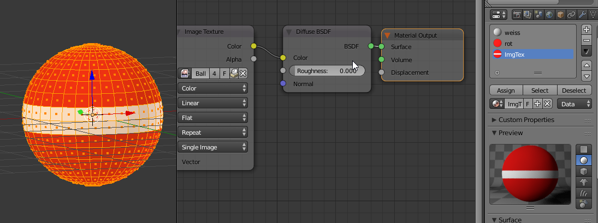

Die Textur in rot und weiss.

### Lipsync Animation

Ich habe "Der Ball" von Rilke mit dem Handy eingelesen.

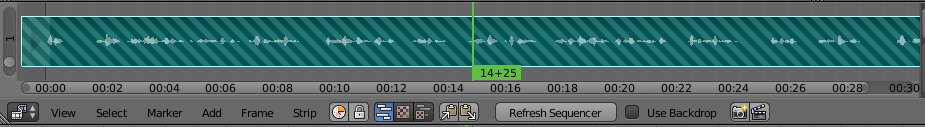

Die Datei habe ich in Blender geladen und dann Keyframes fuer die Shapekeys gesetzt.

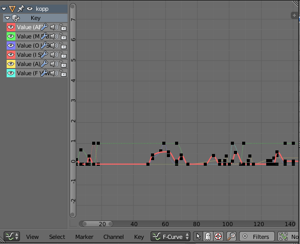

### Rendern

Ich habe die Rendereinstellungen wie folgt eingestellt:

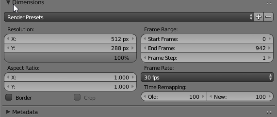

Unter *Light Paths* habe ich zwei Haekchen weggenommen:
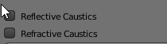
