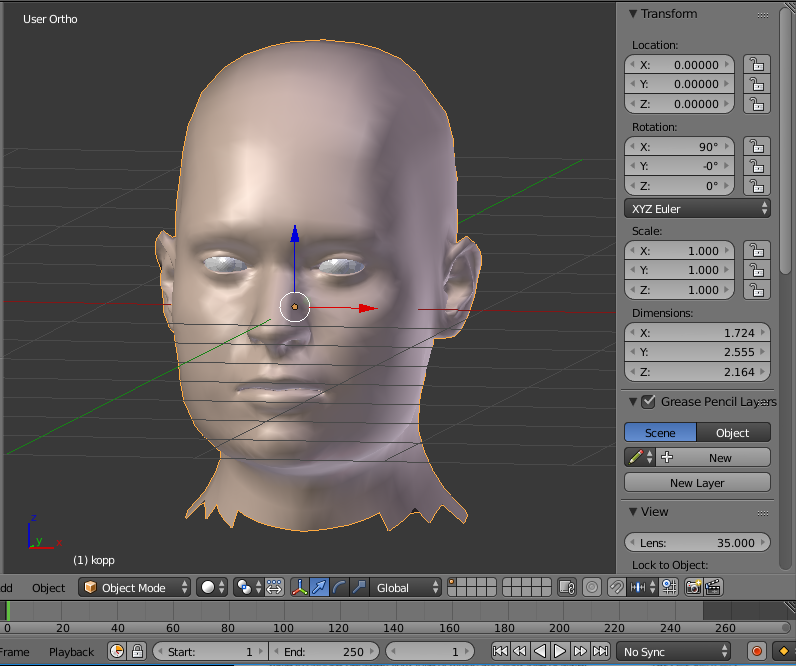
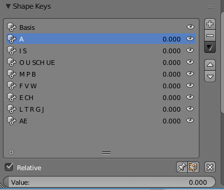
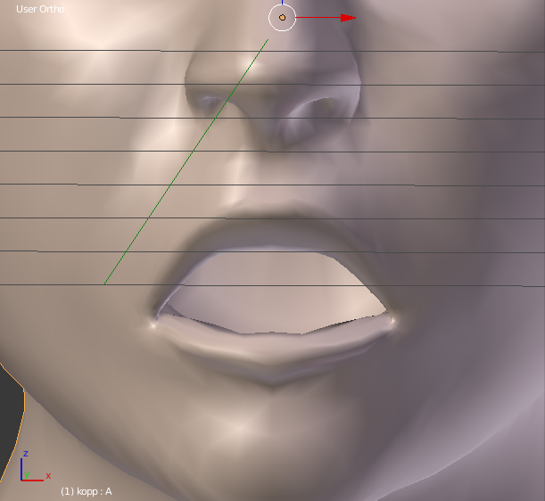
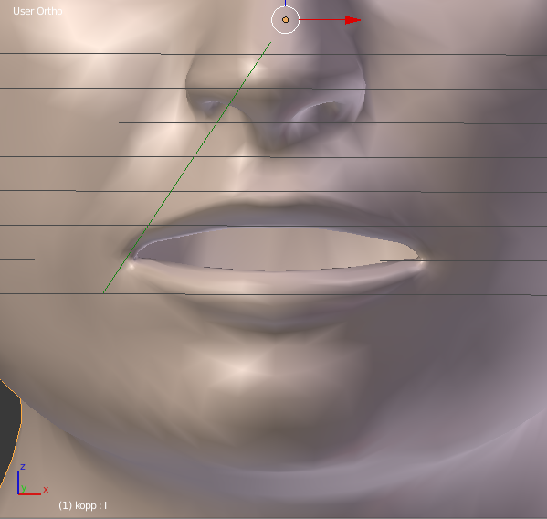
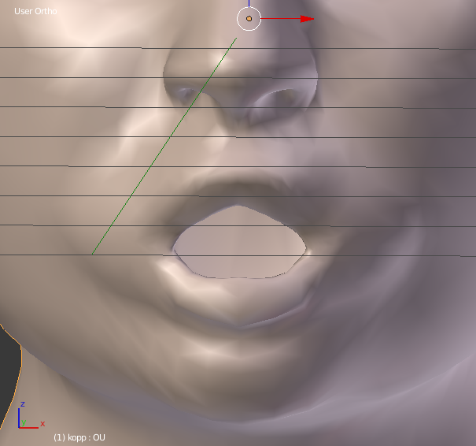
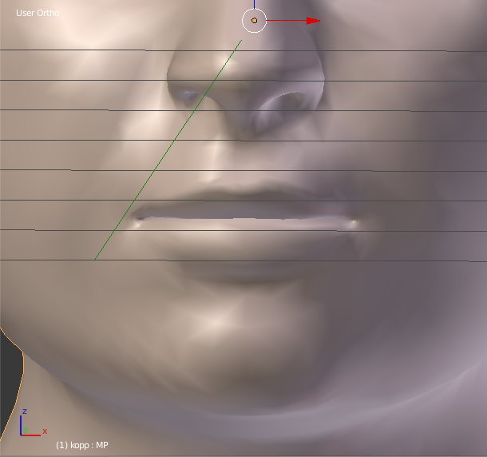

# Dokumentation Aufgabe 2
## Frank Hasenbalg, 571087
### Kopf-Modell
Das Modell des Kopfes ist von Makehuman. Ich habe ein menschliches Mesh generiert und als OBJ zusammen mit der Textur exportiert. Die beiden Teile habe ich in eine Blender-Szene geladen und alles entfernt, was nicht von Nutzen war.

### Shapekeys
Fuer die Shapekeys habe ich die Mundregion und den Unterkiefer des Kopfes verformt.
Aehnlichen lauten wurden die gleichen Formen zugewiesen.

Meist habe ich *Proportional Editing* genutzt.

