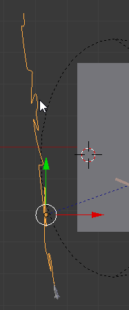
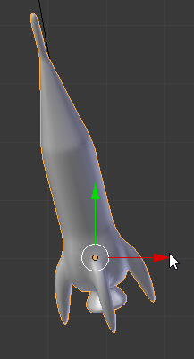
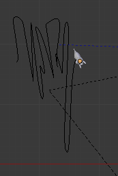
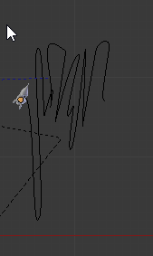
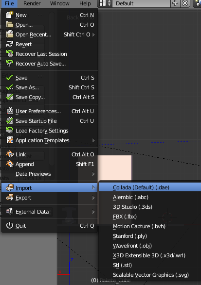
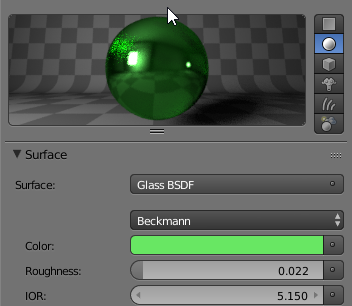
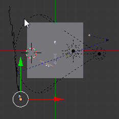
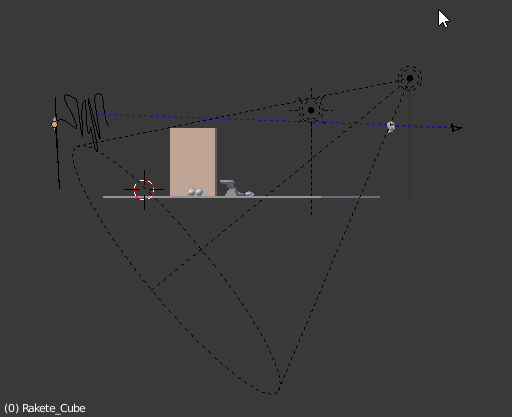
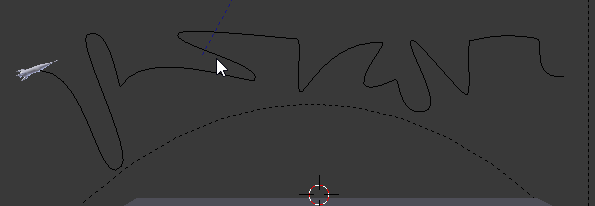
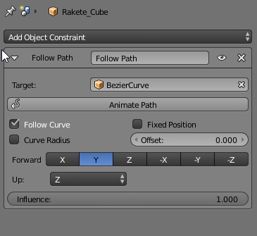

# Dokumentation Aufgabe 3
## Frank Hasenbalg, 571087
2.11.17
### Path-Animation
Pfad erzeugen,
über die *Tab* Taste in den Edit Mode in
der 3D‐View gehen.
Danach den Anfangspunkt auswählen. Danach erneut
*Shift* und *s* und die Selektion auf den Cursor
positionieren.

Den Pfad danach über extrudieren des letzten Punktes wie
gewuenscht modellieren.

Das Material der Rakete ist gruen:

Danach Rakete importieren,
welches dem Pfad folgen soll. Danach den Pfad auswählen, dem
das Objekt folgen soll, als
Zweitselektion über *Shift* und
linke Maustaste.
Danach Follow Path klicken.
Einstellen der
Pfadanimationsdauer bei den
Curve Eigenschaften im Properties
Fenster bei:
Path Animation > Frames.
Die Checkbox bei
Follow setzen.

Foreward: Z, Up: Y

