# Dokumentation Aufgabe 4
## Frank Hasenbalg, 571087
3.11.17
### Rigging
Mesh in makeHuman erzeugt.

In Blender importiert.

Ersten Knochen gesetzt.

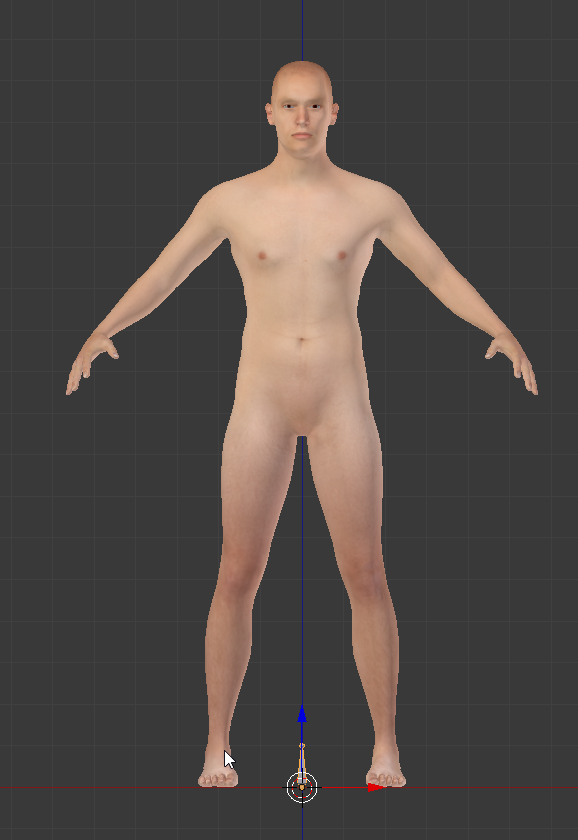

Wirbelsauele vereinfacht nachgebaut.

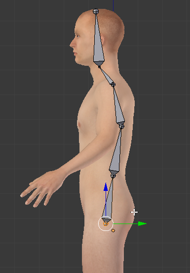

Von allen Seiten ausgerichtet.

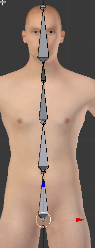

Bein dazu.

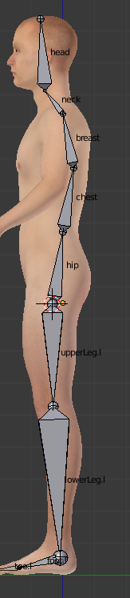

Bein ausrichten.

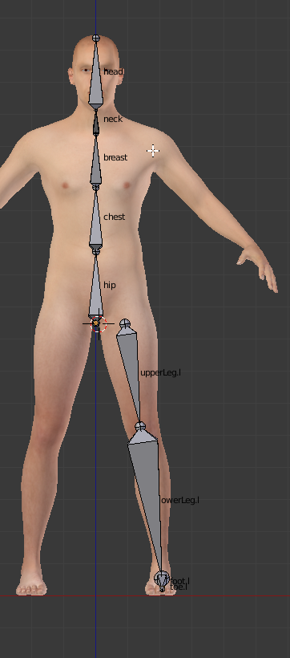

Arm und Bein an die entsprechenden Knochen an der Wirbelsaeule parenten.

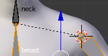

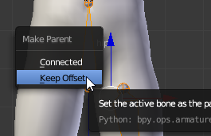

Alles von der Linken auf die rechte Seite kopieren und Namen umkehren.

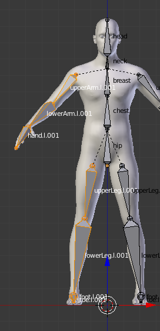

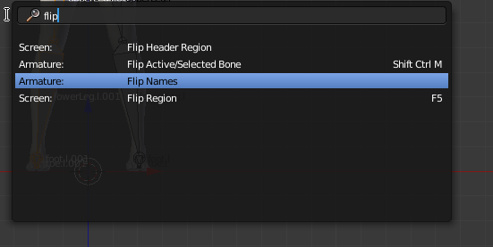

### Skinning
Mit *Automatic Weightpaint* skinnen und dann gucken, wos hakt.

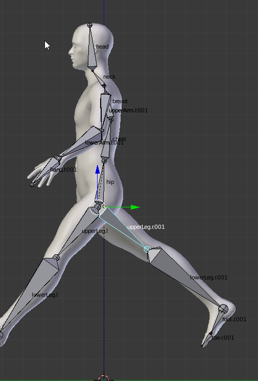

Huefte und Schultern ausbessern.

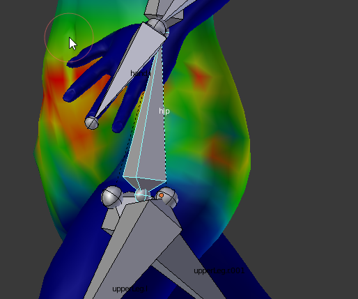

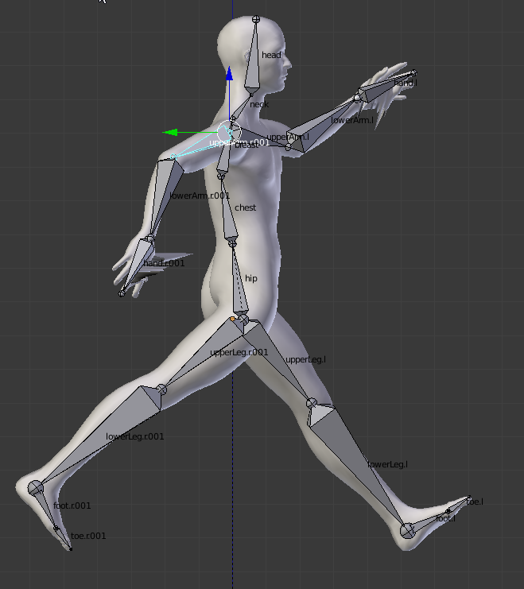

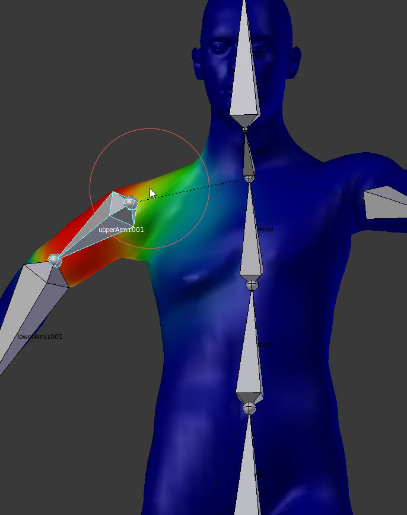

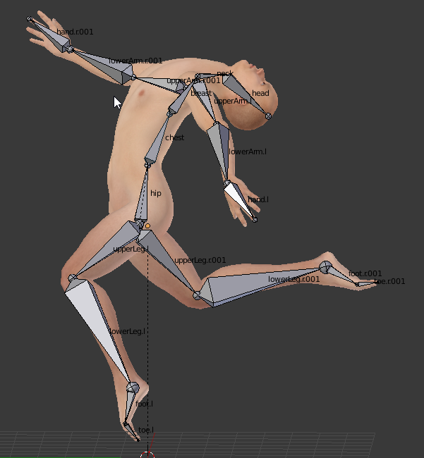

### Animation

## Quellen
- makeHuman, Joel Palmius, Thomas Larsson, Arvind Pinto, Rob Baer, [Version 1.1.1](http://download.tuxfamily.org/makehuman/releases/1.1.1/makehuman-1.1.1-win32.zip), [Lizenz: AGPL3](http://www.makehuman.org/license.php)
