# Dokumentation Aufgabe 5
## Frank Hasenbalg, 571087
9.11.17

## Tisch
Wuerfel flach gedrueckt und 1⁄4 behalten.

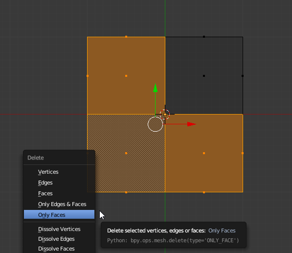

Mirror auf 2 Achsen gestellt.

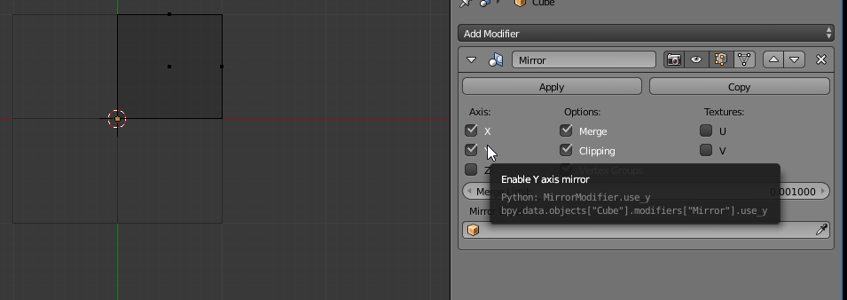

Geometrie fuer die Beine erzeugt.

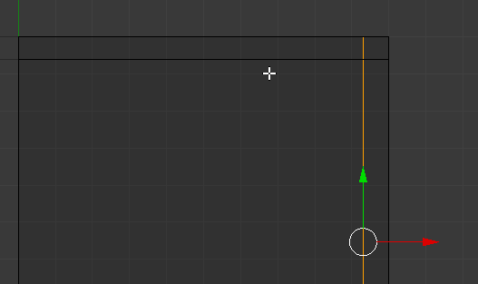

Beine extrudiert.

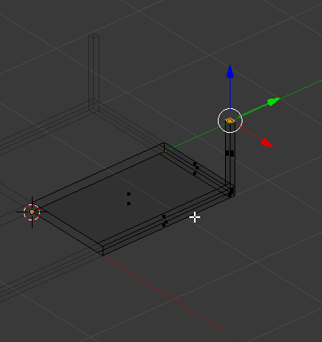

## Stuhl
Analog zum Tisch.

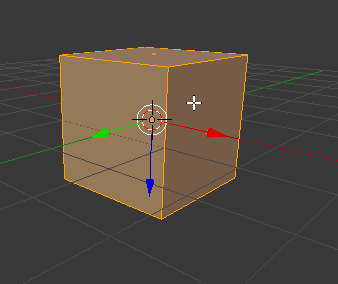
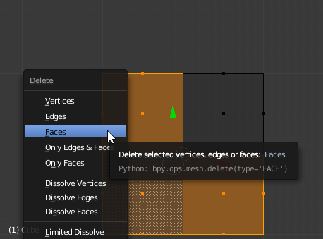
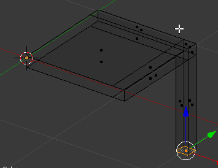
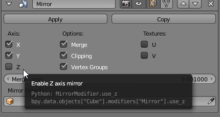
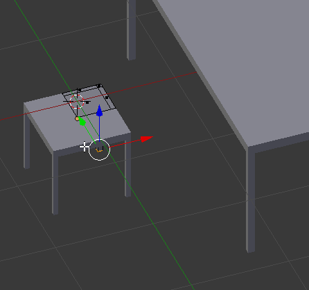
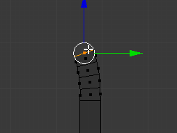

Geschwungene Lehne extrudiert mit einachsigem Mirror.

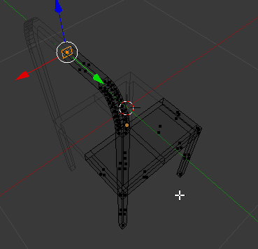
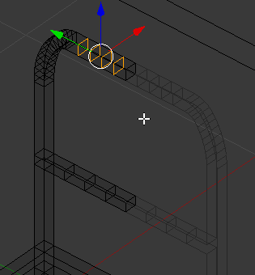
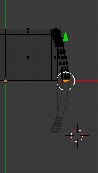

## Sessel
Sudiv auf Wuerfel und angewendet.

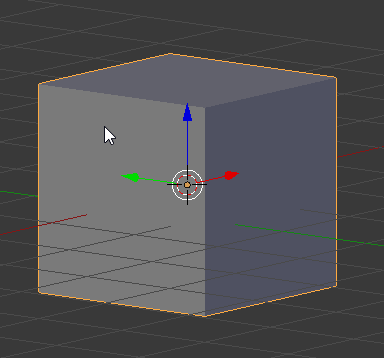
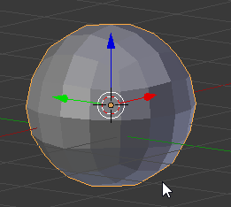
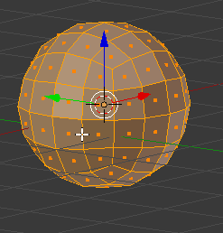

Sessel draus gemacht und Solidify angewendet.

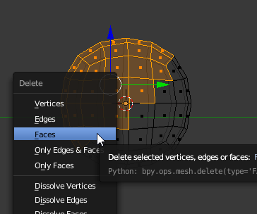
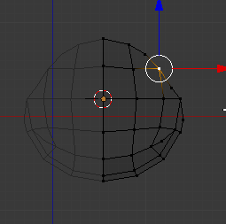
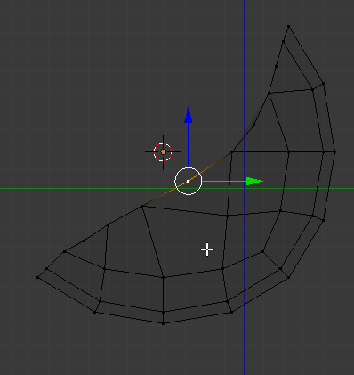
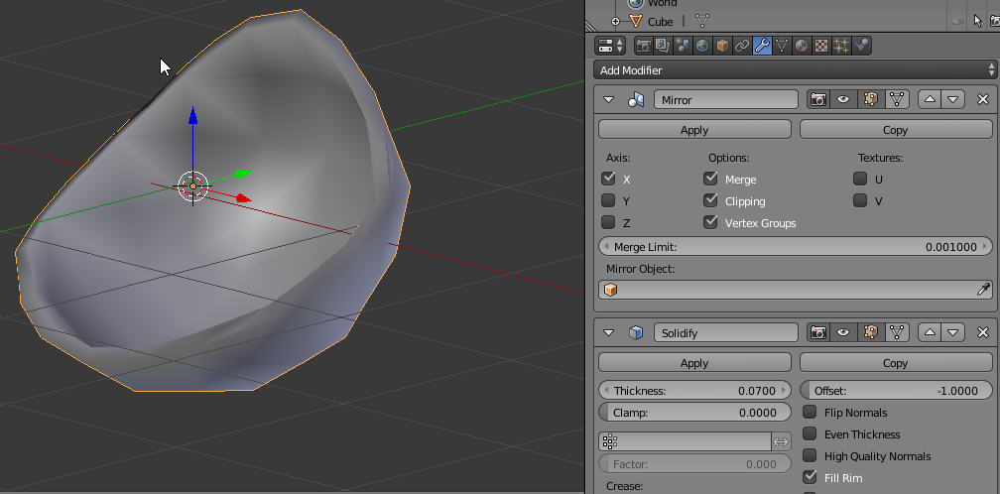
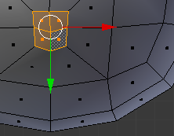

Ring gezogen und Bein extrudiert.

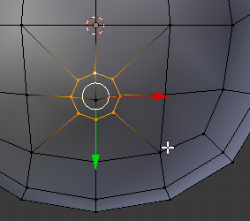

Fuesse extrudiert.

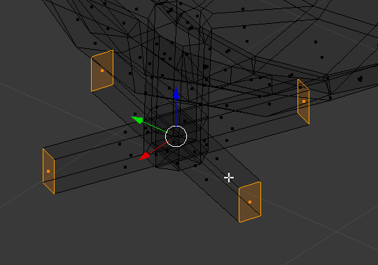
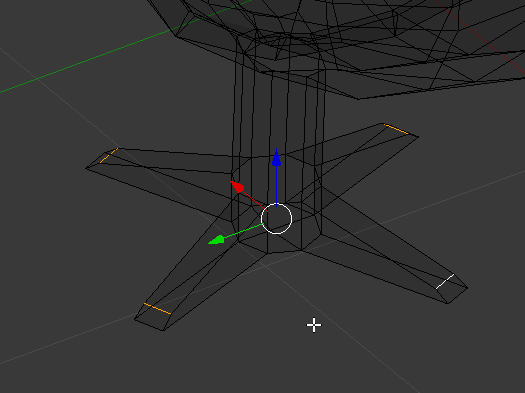

## Animation

## Quellen
- makeHuman, Joel Palmius, Thomas Larsson, Arvind Pinto, Rob Baer, [Version 1.1.1](http://download.tuxfamily.org/makehuman/releases/1.1.1/makehuman-1.1.1-win32.zip), [Lizenz: AGPL3](http://www.makehuman.org/license.php)
